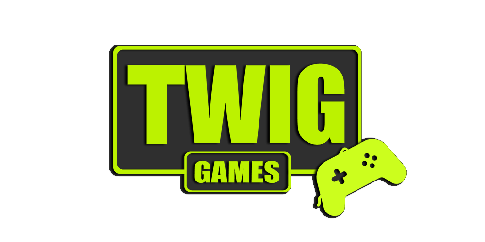
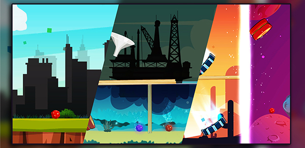
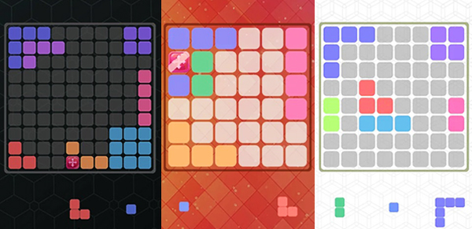
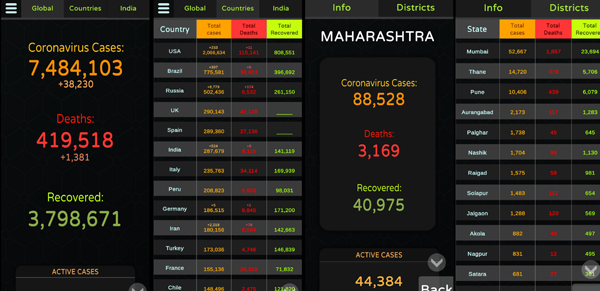
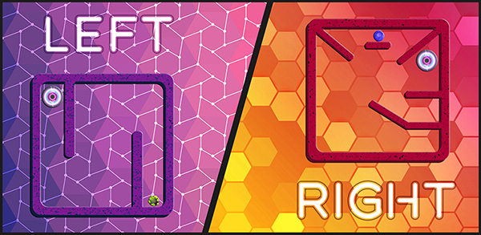
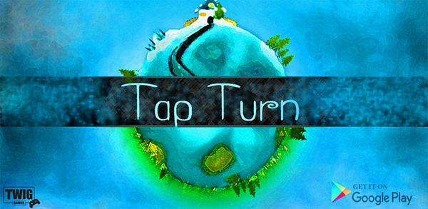
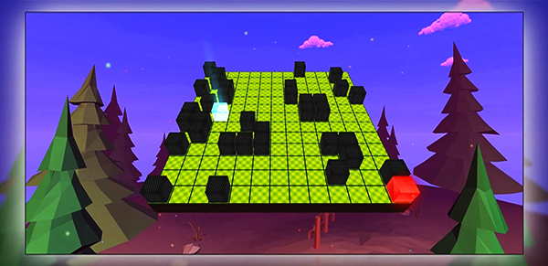
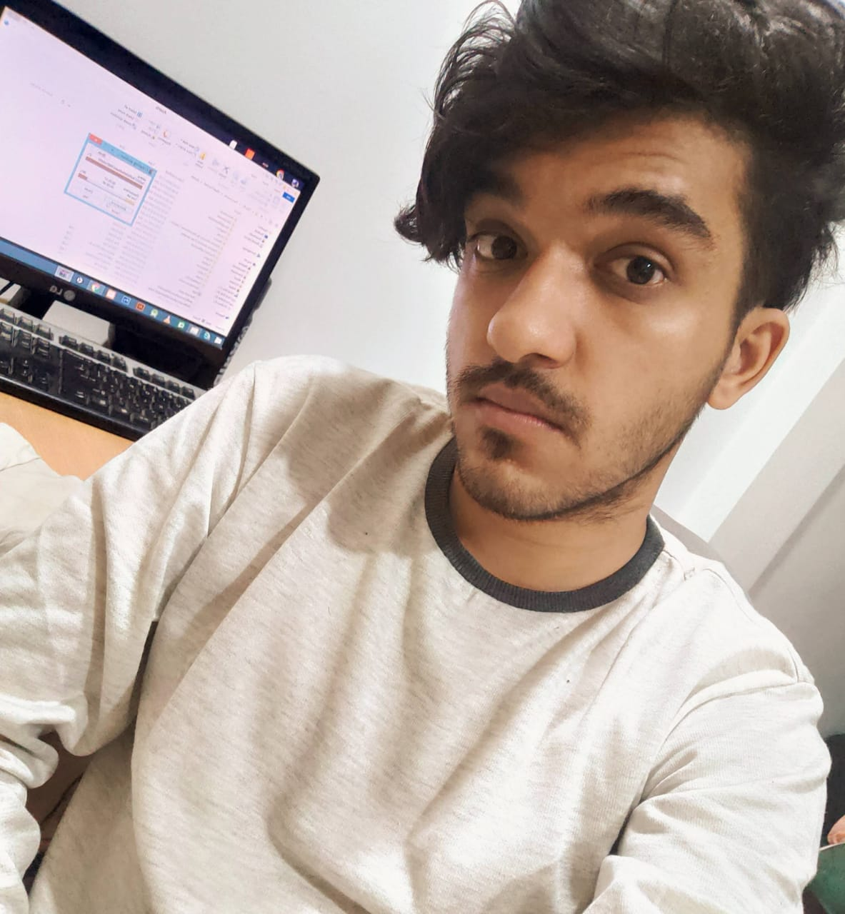

<!DOCTYPE html>
<html lang="en">
<head>

	<meta charset="UTF-8">
	<meta name="viewport" content="width=device-width, initial-scale=1.0">
	<title>Twig Games</title>
	<link rel="stylesheet" href="https://unpkg.com/aos@next/dist/aos.css" />
	<link rel="stylesheet" href="https://use.fontawesome.com/releases/v5.7.2/css/all.css" integrity="sha384-fnmOCqbTlWIlj8LyTjo7mOUStjsKC4pOpQbqyi7RrhN7udi9RwhKkMHpvLbHG9Sr" crossorigin="anonymous">
	<link rel="stylesheet" href="style.css">

	<!--FONT AWESOME-->
	<link rel="stylesheet" href="https://stackpath.bootstrapcdn.com/font-awesome/4.7.0/css/font-awesome.min.css">
	<!--GOOGLE FONTS-->
	
</head>

<body>
	<header class="head">
		
		

			

			

			

		

		<nav class="top-nav">
			<ul class="nav-list">
				<li>
					<a href="index.html" class="nav-link">Home</a>
				</li>
				<li>
					<a href="#about" class="nav-link">About</a>
				</li>
				<li>
					<a href="#services" class="nav-link">Services</a>
				</li>
				<li>
					<a href="#portfolio" class="nav-link">Portfolio</a>
				</li>
			</ul>
		</nav>
		

			
		

	</header>

	<section class="services" id="services">
		

			

				<h1>Services</h1>
				<h6>What I can do for you</h6>
			

			

				

					

						</img>
					

					<h1>Game Development</h1>
					
Have an idea for a game? We'll help you build it. Get end to end game design and Game development services.

				

				

					

						</img>
					

					<h1>App development</h1>
					
Best mobile app development services for enterprise, startups & SME's. Our experienced developers build your application using the latest technologies.

				

				

					

						</img>
					

					<h1>Web Development</h1>
					
Customer-focused web development services built on latest technologies. We specialize in HTML,CSS,PHP,JS

				

				

					

						</img>
					

					<h1>Graphic Design</h1>
					
Get creative Graphic designing service for logo, website, brochure, flyer, mobile app etc.

				

			

		

	</section>

	<section class="portfolio" id="portfolio">
		

			

				<h1>Portfolio</h1>
				<h6>View some of my work</h6>
			

			<video class="promo-video"  autoplay controls muted loop>
  			<source src="video/draghit.mp4" type="video/MP4">
			</video>
			

			

				

					
				

				

					<h6>Drag Hit</h6>
					
Drag and release to launch the ball.Hit the purple ball to complete the level. 

					   <a href="https://play.google.com/store/apps/details?id=com.twig.DragHit" class="cta">
</a>
				

			

			

				

					
				

				

					<h6>Place-it</h6>
					
Place-it is a brain teaser addictive game designed to decision making and helps to train your brain.

					   <a href="https://play.google.com/store/apps/details?id=com.TwigGames.Placeit" class="cta"> 
</a>
				

			

			

				

					
				

				

					<h6>Covid-19 Tracker</h6>
					
Live statistics and coronavirus news tracking the number of confirmed cases, recovered patients, tests, and death toll due to the COVID-19.

					   <a href="https://drive.google.com/file/d/1v3uLKHxM6Cn6QJ92bKqmzCPiAhAAK_qU/view?usp=sharing" class="cta">
</a>
				

			

			

				

					
				

				

					<h6>Left Right</h6>
					
The goal is to make ball reach the power source by rotating the level. Are you capable of solving these puzzles?

					<a href="https://play.google.com/store/apps/details?id=com.TwigGames.LeftRight" class="cta">
</a>				

			

			

				

					
				

				

					<h6>Tap Turn</h6>
					
"Tap to Turn" and avoid Meteors. 

					      <a href="https://play.google.com/store/apps/details?id=com.twig.tapturn" class="cta"> 
</a>
				

			

			

				

					
				

				

					<h6>Tilt'n Dodge</h6>
					
Tilt your device and dodge the obstacles . Use powerups and your surrounding wisely to pass through various levels.

					   <a href="https://play.google.com/store/apps/details?id=com.twig.lets_roll" class="cta">
</a>
				

			

			

				

					
				

				

					<h6>Dynamic Maze</h6>
					
Click on the ground to move red box.Reach blue box to complete the level.
						Can you solve the puzzle?. 

					   <a href="https://play.google.com/store/apps/details?id=com.TwigGames.dynamicmaze" class="cta"> 
</a>
				

			

		

		

	</section>
	<section class="about" id="about">
		

			

				

					<h1>About</h1>
					<h6>Us</h6>
				

				
Twig Games is a game development company which mainly focus on providing high quality , fun , relaxing games to the users. Founded in 2019, Twig Games is headquartered in India.

				   

					<ul class="nav-list">
						<li>
							
						</li>
						<li>
							
						</li>
						<li>
							
						</li>
					</ul>
				

			

		

		

			
			

				<h1>Aman Awdhani  (Founder)</h1>
			

		

	</section>

	<section class="experience" id="experience">
		

			

				<h1>Contact Us</h1>

			

			

				<ul>
					<li class="date">
						<h1>Address:
						B89 New Ashoka Garden
						Bhopal, MP, India
						</h1>
						<h1>Phone:
						+918269494623
						</h1>
						<h1>Email:
						twiggames19@gmail.com
						</h1>
					</li>
				</ul>
			

		

	</section>

	<footer class="copyright">
		

			<i class="fas fa-chevron-up"></i>
		

		
&copy; 2020 Twig Games

	</footer>

	
    
    
	

</body>
</html>
